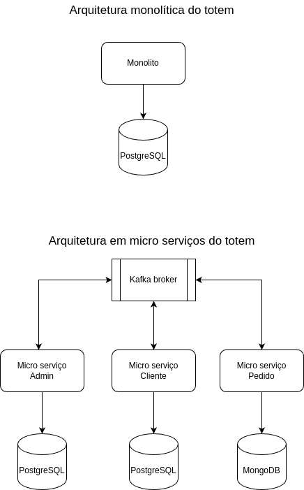
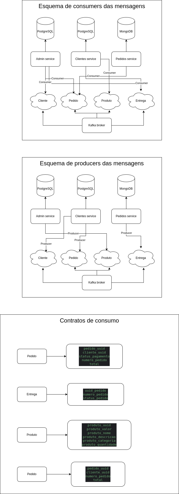

## Diagrama de arquitetura de tecnologias utilizadas no projeto
- Arquitetura antiga do projeto, onde o projeto era monolítico e utilizava o banco de dados Postgres.
- Arquitetura nova do projeto, onde o projeto foi dividido em micro-serviços e utiliza o banco de dados Postgres e MongoDB.

## Diagrama de mensageria entre os micro-serviços [Consumers e Producers]
